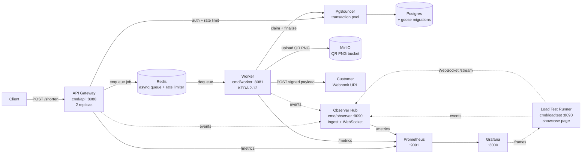

# ShortLink

[](https://go.dev) [](#license)

A production-grade URL shortener + QR-code generator built in Go as a portfolio
demonstration of distributed systems, async processing, Kubernetes
orchestration, and real-time observability. The platform is intentionally
over-engineered relative to its surface area — the point is the architecture,
not the feature list.

- **Spec-driven**: [docs/SPEC.md](docs/SPEC.md) is the source of truth; every
  judgment call lives in [docs/DECISIONS.md](docs/DECISIONS.md).
- **Audited**: deferred findings tracked in [docs/AUDIT.md](docs/AUDIT.md).
- **Tested end-to-end**: [tests/integration_test.go](tests/integration_test.go)
  exercises the full pipeline against ephemeral containers.

---

## Architecture



The async pipeline is **lease-guarded** (`updated_at` is the lease token) and
**single-delivery** (asynq's at-most-once guarantee plus an unconditional
re-claim). Webhook delivery is a **separate job** so a slow customer endpoint
never starves the shorten worker. Per-key rate limiting runs on a Redis
sliding window via a Lua script for atomicity. Pod-aware autoscaling is
driven by **KEDA** watching the asynq pending list directly.

See [docs/SPEC.md](docs/SPEC.md) for the full architecture, [docs/DECISIONS.md](docs/DECISIONS.md)
for *why* every non-obvious call was made.

---

## Quickstart

### Prerequisites

- Go 1.26+
- Docker + docker compose (for the local stack)

### Bring up the stack

```sh
make dev         # Postgres + MinIO + Redis + PgBouncer + Prometheus + Grafana
make migrate     # apply schema
make keys        # generate three test API keys -> config/keys.yaml

# In separate terminals (or background):
make run-observer
make run-worker
make run-api
```

Then shorten a URL using a key printed by `make keys`:

```sh
curl -X POST http://localhost:8080/shorten \
  -H "X-Api-Key: sl_live_..." \
  -H "Content-Type: application/json" \
  -d '{
    "url": "https://example.com/very/long/path",
    "webhook_url": "https://webhook.site/your-id"
  }'
```

The response is `202 Accepted` with a `job_id`. The result is delivered
asynchronously to the webhook URL, signed with `X-ShortLink-Signature:
sha256=<hex>`. Visiting `http://localhost:8080/{slug}` 302-redirects to
the original URL.

### Showcase dashboard

```sh
make loadtest    # serves http://localhost:8090 + runs a vegeta attack
```

Opens a live page with per-key metrics (WebSocket from observer), a 500-entry
log audit panel, and embedded Grafana iframes. The runner stays up after the
attack completes so the final dashboard is inspectable; Ctrl-C tears it down.

### Run on Kubernetes

```sh
make k8s-up      # builds images, kind-loads them, helm upgrade --install
make k8s-status
make k8s-logs
```

Requires `kind`, `kubectl`, `helm`, plus Calico for NetworkPolicy enforcement
and KEDA for worker autoscaling. The one-time cluster setup is in
[deploy/k8s/README.md](deploy/k8s/README.md).

### Run the end-to-end integration test

```sh
make test-integration
```

Spins up Postgres, Redis, and MinIO via `testcontainers-go`, builds the api
and worker binaries, exercises POST /shorten end-to-end, and verifies the
HMAC-signed webhook arrives with the expected payload + the QR PNG is
fetchable from the signed URL.

---

## Layout

| Path | Purpose |
|------|---------|
| [cmd/api/](cmd/api/) | Gateway — authenticate, rate-limit, reserve, enqueue |
| [cmd/worker/](cmd/worker/) | Queue consumer — shorten + webhook handlers + sweeper |
| [cmd/observer/](cmd/observer/) | Observer hub — `/ingest`, WebSocket `/stream`, `/metrics` |
| [cmd/loadtest/](cmd/loadtest/) | Vegeta load-test runner + showcase HTTP page |
| [cmd/migrate/](cmd/migrate/) | goose migration runner |
| [cmd/keygen/](cmd/keygen/) | API key + webhook secret provisioning |
| [internal/](internal/) | Domain packages (auth, shortener, qrcode, queue, webhook, sweeper, metrics, events, observer, …) |
| [migrations/](migrations/) | Postgres schema (goose-format `.sql`) |
| [deploy/](deploy/) | docker-compose stack + Helm chart + Prometheus/Grafana provisioning |
| [tests/](tests/) | End-to-end integration test (`testcontainers-go`) |
| [docs/](docs/) | [SPEC.md](docs/SPEC.md), [DECISIONS.md](docs/DECISIONS.md), [AUDIT.md](docs/AUDIT.md) |
| [Dockerfile](Dockerfile) | Multi-stage; `--build-arg BINARY={api,worker,observer,loadtest,migrate,keygen}` |

---

## Milestones

The repo was built spec-first, milestone-by-milestone. Each milestone is one
or more commits on `main`; the deferred-findings audit between milestones is
recorded in [docs/AUDIT.md](docs/AUDIT.md).

| #  | Milestone | What landed |
| -- | --------- | ----------- |
| M1 | Core async pipeline | `cmd/api` + `cmd/worker` (in-process queue), Postgres + MinIO, SSRF guard, HMAC-signed webhook |
| M2 | Redis queue + worker split | asynq queue, lease-guarded idempotency, retry + dead-letter, sweeper, worker becomes its own binary |
| M3 | Rate limiting | Per-key sliding-window via Redis Lua, free/pro/unlimited tiers, SETNX-throttled `last_used_at`, 429 with `X-RateLimit-*` + `Retry-After` |
| M4 | Observer hub | `internal/events` best-effort emitter, `cmd/observer` ingest + 100ms aggregator + 5s Redis poller + 500ms WebSocket broadcaster, pod heartbeats |
| M5 | Load test runner | `cmd/loadtest` vegeta multi-key attacker, HMAC-verifying sink, `attack_started`/`attack_complete` events |
| M6 | Showcase frontend | Vanilla HTML+CSS+JS embedded via `go:embed`; live key-stats table, log audit panel with TTL countdown, filters, exponential-backoff WS reconnect |
| M7 | Observability stack | `internal/metrics` collectors (jobs, QR, rate-limit, webhook, events), Prometheus + Grafana in compose with provisioned dashboards, showcase iframes wired |
| M8 | Kubernetes + deployment | One multi-stage Dockerfile, Helm chart under `deploy/k8s/`, PgBouncer Deployment, Migration Job as Helm hook, KEDA ScaledObject, SSRF egress NetworkPolicy |
| M9 | Polish | This README, end-to-end integration test against testcontainers |

---

## Project conventions

- **Module path**: `github.com/leninboccardo/shortlink`
- **Go version**: 1.26 (`go 1.26` in `go.mod`)
- **Module-style commits**: one logical change per commit, scoped subject lines
- **Security baseline**: API keys stored only as SHA-256 hashes; raw key shown
  once at `make keys` time. Webhook payloads signed HMAC-SHA256 per-key.
  Customer URLs SSRF-guarded at the gateway and re-validated at the worker.
  See [docs/DECISIONS.md §4 / §5](docs/DECISIONS.md).
- **No tests in main package**: integration tests live in `tests/` behind
  a `//go:build integration` tag so `go test ./...` stays Docker-free.

---

## License

MIT.
